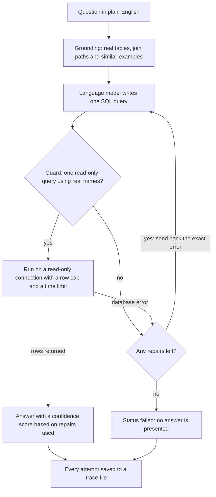
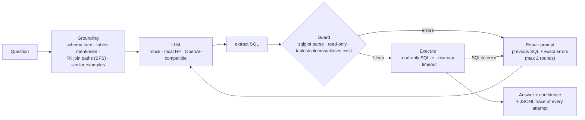

# nl2sql-agent

**A schema-grounded natural-language-to-SQL agent: foreign-key join-path resolution, a read-only SQL guard that feeds its errors back into a bounded repair loop, evidence traces for every attempt, and an evaluation harness with deterministic result matching. Measured on a 30-question golden set with a local 1.5B model on a laptop GPU.**

  [](https://github.com/gandhiashutosh14/nl2sql-agent/actions/workflows/ci.yml) 

---

> **In plain English:** Business users want database answers without learning SQL (the language of databases), but SQL written by a language model can be wrong, unsafe or slow. This repository wraps the model in checks: real tables only, read-only queries, a retry with the exact error, and scoring against known answers. It is a tested working prototype on a public sample database, measured with one small model on a laptop.
>
> **Reading guide:** business readers can read the next three sections, then jump to [SWOT](#swot-analysis) and [where this applies](#where-this-applies). Engineers can go straight to [What it is, and why](#what-it-is-and-why).

## The problem in plain English

A sales director wants to know which country has the most customers. The answer sits in a database. Getting it usually means asking an analyst to write a query in SQL (Structured Query Language), then waiting.

A large language model (LLM) can write that query in seconds. The catch is that it can be confidently wrong. It may name a table that does not exist, or join tables the question never mentioned and return the wrong number. In the model run committed to this repository, a small model turned "5 minutes" into 500,000 milliseconds instead of 300,000 ([report](reports/qwen2.5-coder-1.5b-instruct.md#mismatches)). Connected carelessly, a model could also send a command that changes or deletes records, or a query that runs for minutes.

<p align="center"></p>
<p align="center"><sub>An SQL statement that changes data. The guard in this repository refuses statements like this before they reach the database.<br>Image: <a href="https://commons.wikimedia.org/wiki/File:SQL_ANATOMY_wiki.svg">SQL ANATOMY wiki.svg</a> by SqlPac, modified by Ferdna, <a href="https://creativecommons.org/licenses/by-sa/3.0/">CC BY-SA 3.0</a>, via Wikimedia Commons.</sub></p>

So the hard part is not getting SQL out of a model. It is knowing when the SQL is safe to run and when the answer can be trusted. That takes three things: guardrails that stop bad queries before they reach the data, a way to recover from mistakes, and a repeatable accuracy test. This repository builds all three around [Chinook](https://github.com/lerocha/chinook-database), a public sample database of a digital media store with artists, albums, tracks, customers and invoices.

## Executive summary

| Question | Answer |
|---|---|
| What problem does this address? | Letting people ask a database questions in plain English without a language model returning wrong figures, changing data or running unbounded queries. |
| Who has this problem? | Data and analytics teams, reporting leads, and product teams adding "ask your data" features for staff or customers. |
| What does this repository do? | It gives the model the real database structure, checks every generated query with a read-only guard, allows at most two retries with the exact error ([`nl2sql/agent.py`](nl2sql/agent.py)), runs queries on a read-only connection with limits, and records every attempt. A harness scores the answers against 30 reference questions ([`golden/chinook_golden.json`](golden/chinook_golden.json)). |
| What has been shown so far? | With Qwen2.5-Coder-1.5B-Instruct, a local model of 1.5 billion parameters (1.5B), 29 of 30 generated queries ran and 24 of 30 returned the correct rows ([report](reports/qwen2.5-coder-1.5b-instruct.md)). Replaying the reference SQL through the harness scores 30 of 30, which checks the harness rather than a model ([oracle run](reports/oracle-harness.md)). All 17 fixed guard inputs give the expected outcome ([guard report](reports/guard-rejections.md)). 50 automated tests pass with a scripted model ([Quick start](#quick-start)). |
| How mature is it? | Working prototype: one public sample database, 30 questions written by the author and one small model. The numbers are a sanity check, not a benchmark ([Status and scope](#status-and-scope)). The 24 of 30 run predates the latest prompt changes, as the report's provenance note says. |
| What it is not | Not a hosted service: it is a command-line tool and Python library. Not tested on any database other than Chinook, not compared across models, and SQLite only. It has no user accounts or per-user data permissions. |
| What it would take to use it for real | An executor and SQL dialect for the production database, a golden set built from real users' questions, an evaluation of the chosen model, access control tied to each user's identity, and monitoring of the traces. |

## How it works, end to end



This is the business view; [How it works](#how-it-works) below shows the same loop at module level.

1. **Ground the question.** [`nl2sql/schema.py`](nl2sql/schema.py) reads the database's own structure: tables, columns, keys and row counts. It finds the tables the question names and works out how they connect through foreign keys, so the model is told `Track.AlbumId = Album.AlbumId` rather than guessing.
2. **Add house examples.** [`nl2sql/examples.py`](nl2sql/examples.py) picks up to 4 similar worked examples from a bank of 12 ([`examples/chinook_examples.json`](examples/chinook_examples.json)). They teach local habits, such as how dates are stored.
3. **Draft the query.** The language model writes one SQL query. [`nl2sql/llm.py`](nl2sql/llm.py) supports a scripted mock for tests, a local Hugging Face model and any OpenAI-compatible endpoint.
4. **Check it before it runs.** [`nl2sql/guard.py`](nl2sql/guard.py) parses the query with sqlglot. It refuses anything except a single read-only query, then checks every table and column name against the real schema.
5. **Repair with the real error.** If the guard or the database reports a problem, the model gets its previous query and the exact error, at most twice ([`nl2sql/agent.py`](nl2sql/agent.py)).
6. **Run it safely.** [`nl2sql/executor.py`](nl2sql/executor.py) opens the database file read-only, returns at most 200 rows and cancels the query after 5 seconds.
7. **Answer and record.** Confidence is 1.0, 0.7 or 0.5 after zero, one or two repairs ([`nl2sql/agent.py`](nl2sql/agent.py)). If the repairs run out, the status is `failed` and no answer is presented. Every attempt is written to `traces/traces.jsonl`.
8. **Measure.** `nl2sql eval` runs the golden questions and compares the returned rows with the reference rows, ignoring row order, letter case and number formatting ([`nl2sql/evaluate.py`](nl2sql/evaluate.py)).

**Worked example.** One test in [`tests/test_nl2sql.py`](tests/test_nl2sql.py) runs the full loop with two scripted model replies. It shows the safety net working, not the quality of any model.

| Step | What happens |
|---|---|
| Question | "How many customers are there?" |
| First draft | `SELECT COUNT(*) FROM Customers`, but the real table is called `Customer` |
| Guard | Stops the query before it runs and explains: "Unknown table 'Customers'. Available tables: Album, Artist, Customer, ..." |
| Repair | The model receives that sentence and returns `SELECT COUNT(*) AS n FROM Customer` |
| Result | The query runs read-only and returns 59, with status `ok`, one repair and confidence 0.7; the attempt is written to the trace file |

A real miss looks different. In the committed model run, question g22 kept using a column that does not exist, even after both repairs. The agent therefore returned `failed` instead of a wrong figure ([report](reports/qwen2.5-coder-1.5b-instruct.md#mismatches)).

---

## What it is, and why

Text-to-SQL demos usually stop at "the model wrote a query". Production systems need the rest: the model must only see real tables and columns, be told how tables join, be prevented from writing anything, get a second chance with the actual error when it is wrong, and be scored on whether the answer is right rather than whether the SQL looks plausible. This repository is that pipeline, built on the public Chinook database and evaluated with a model small enough to run on a laptop.

## How it works



The evaluation harness runs a golden set through the agent and scores **execution success**, **result match** (row multisets compared after normalising numbers, case and order), and optionally an **LLM judge** for formulations that differ but answer the question.

## Measured results

`Qwen/Qwen2.5-Coder-1.5B-Instruct`, fp16 on an RTX 4050 laptop GPU, greedy decoding, 30 questions, 2026-09-16 (report committed as [`reports/qwen2.5-coder-1.5b-instruct.md`](reports/qwen2.5-coder-1.5b-instruct.md)):

| Metric | Value |
|---|---|
| Execution success | 29 / 30 |
| Result match (deterministic) | 24 / 30 |
| Repairs used: none / one / two | 24 / 5 / 1 |
| Median latency per question | 2.1 s |
| Whole run | 128 s |

What the six misses were, from the mismatch section of the report: three unnecessary joins (the model joined Employee or Genre when the question involved one table, once dropping a GROUP BY as a result), one unit error (5 minutes became 500,000 ms), one wrong column that survived both repair rounds, and one self-join formulation of a subquery question. The join-hint logic and the prompt were tightened after this run (hints now cover only tables the question names; the prompt forbids unneeded joins and states 1 minute = 60,000 ms); a re-run with those changes was started but stopped before completion, so the numbers above are for the code before the tightening, and the report file carries a provenance note saying so.

## What is measured, and how

| Question | Answer |
|---|---|
| What database? | SQLite only (`data/chinook.sqlite`, the public Chinook sample, invoice years 2021 to 2025 in this build). Another engine needs a new executor and a sqlglot dialect string. |
| What can the generated SQL do? | Only read. The guard refuses anything that is not one read-only statement before the database sees it, and the executor opens the file with `mode=ro`, caps rows at 200 and cancels after 5 s. The read-only connection is itself tested with an INSERT. |
| What is a "repair"? | The model gets the exact guard or SQLite error and one more try, at most twice. Confidence is 1.0 / 0.7 / 0.5 by repairs used; below 0.5 the answer is `needs_review`. |
| Which numbers came from a model? | Only the table above (Qwen2.5-Coder-1.5B, one GPU run, 30 questions). Everything else in `reports/` was produced without a model. |
| What did the harness itself score? | [`reports/oracle-harness.md`](reports/oracle-harness.md): the golden SQL replayed as if a model had written it scores 30 / 30 on execution and result match with zero repairs. That proves the harness, guard, executor and matcher agree on every reference query; it says nothing about any model. The same run with the questions changed scores 0 / 30 on match, so the matcher is not trivially satisfied (tested). |
| What does the guard reject? | [`reports/guard-rejections.md`](reports/guard-rejections.md): 17 fixed inputs (writes, DDL, PRAGMA, two statements, unterminated strings, unknown tables and columns, and clean queries with aliases and CTEs) with the outcome and the sentence the model would be shown. Generated by `python scripts/show_guard.py`; a test asserts every outcome. |
| One known failure | g22 ("Which sales support agent generated the most invoice revenue?"): the model put `SupportRepId` on Employee instead of Customer, the guard reported the exact column list, and both repairs kept the mistake. The trace of that case is in the report. |
| What is not measured | Any other database, questions the author did not write, models other than the one above, and the LLM-judge path (implemented and mock-tested, unused for the numbers). |

## Key features

- **Schema grounding from the database itself**: tables, types, primary keys, foreign keys and row counts are introspected and rendered into a compact schema card. Join hints come from BFS over the foreign-key graph, so the model is told `Track.AlbumId = Album.AlbumId` rather than guessing.
- **Curated examples, retrieved by lexical overlap**, teach house conventions such as `strftime('%Y', InvoiceDate)` for years.
- **A guard that fails loudly and usefully**: single statement only, SELECT only, every table and column checked against the schema with alias, CTE and select-list-alias awareness. Errors are sentences the model can act on.
- **Bounded repair**: at most two repair rounds, each carrying the previous SQL and the exact guard or SQLite error. Confidence is derived from repairs used; below threshold the answer is returned as `needs_review`, never presented as fact.
- **Evidence**: every attempt (raw reply, SQL, guard errors, execution error, timings) is written to `traces/traces.jsonl`.
- **Evaluation harness** with a Markdown report, per-case table and a mismatch appendix.

## Tech stack

Python 3.10+ · sqlglot · SQLite · optional: PyTorch + Transformers for local models, any OpenAI-compatible endpoint (OpenAI, Groq, Ollama, vLLM) via `openai:<model>`.

## Quick start

```bash
git clone https://github.com/gandhiashutosh14/nl2sql-agent.git
cd nl2sql-agent
python -m venv .venv && .venv\Scripts\activate      # macOS/Linux: source .venv/bin/activate
pip install -e ".[dev]"
pytest -q                                            # 50 passed, mock model, no GPU

nl2sql schema --db data/chinook.sqlite               # schema card + join graph

# No model needed: replay the golden SQL through the whole pipeline (harness check, 30/30 expected)
nl2sql eval --db data/chinook.sqlite --llm oracle:golden/chinook_golden.json \
  --golden golden/chinook_golden.json --report reports/oracle-harness.md

# No model needed: what the guard does with 17 fixed inputs
python scripts/show_guard.py --db data/chinook.sqlite --out reports/guard-rejections.md

# Local model (needs the hf extra: pip install -e ".[hf]"; ~3 GB download, GPU recommended)
nl2sql ask --db data/chinook.sqlite --llm hf:Qwen/Qwen2.5-Coder-1.5B-Instruct \
  --examples examples/chinook_examples.json "Which country has the most customers?"

# Any OpenAI-compatible endpoint (Ollama: NL2SQL_BASE_URL=http://localhost:11434/v1)
nl2sql eval --db data/chinook.sqlite --llm openai:gpt-4o-mini --examples examples/chinook_examples.json \
  --golden golden/chinook_golden.json --report reports/run.md --json reports/run.json
```

## Project layout

```
nl2sql/schema.py      introspection, schema card, join paths, table mentions
nl2sql/guard.py       parse, read-only enforcement, identifier validation
nl2sql/executor.py    read-only execution with row cap and timeout
nl2sql/examples.py    few-shot bank + retrieval
nl2sql/prompts.py     prompt contracts, SQL extraction, judge parsing
nl2sql/llm.py         mock / oracle (golden replay) / local HF / OpenAI-compatible backends
scripts/show_guard.py fixed inputs through the guard -> reports/guard-rejections.md
nl2sql/agent.py       the loop, confidence, traces
nl2sql/evaluate.py    golden-set harness and report
golden/               30 questions with reference SQL (tested to run and return real answers)
examples/             12 few-shot examples
reports/              the model run, the oracle harness run, the guard outcomes
docs/DEVELOPMENT_NOTES.md  how this was built, including every bug the runs found
```

## Status and scope

Working prototype. One database, one golden set the author wrote, one small model; the numbers are a sanity check of the agent, not a benchmark of the model. Dialect support is SQLite; other engines need an executor and dialect string change. The LLM-judge path is implemented and tested with a mock but was not used for the committed numbers.

## SWOT analysis

A SWOT analysis lists **S**trengths and **W**eaknesses (inside the project) and **O**pportunities and **T**hreats (outside it).

| | Helpful | Harmful |
|---|---|---|
| **Internal** | **Strengths**<br>• Safety sits in code, not in the model: a parser-based guard plus a read-only database connection, both tested<br>• Errors become feedback: the model sees the exact problem, with a hard limit of two repairs ([`nl2sql/agent.py`](nl2sql/agent.py))<br>• Answers are scored the same way every time, and the scoring itself is checked: replaying the reference SQL scores 30 of 30 ([oracle run](reports/oracle-harness.md))<br>• Every attempt is traced, so a reviewer can see how each answer was produced<br>• Works with a scripted mock, a local model or any OpenAI-compatible endpoint | **Weaknesses**<br>• One public sample database and 30 questions written by the author ([golden set](golden/chinook_golden.json)): a sanity check, not a benchmark<br>• One real model run, 24 of 30 ([report](reports/qwen2.5-coder-1.5b-instruct.md)), made before the latest prompt changes; the re-run was stopped before it finished<br>• SQLite only; another database engine needs a new executor and dialect<br>• Join hints depend on table names appearing in the question, so differently worded questions get less reliable hints<br>• The LLM-judge path is built and mock-tested but unused for the numbers; there is no access control, service layer or load test |
| **External** | **Opportunities**<br>• Demand for self-service analytics that business users can trust<br>• The same guard, repair and evaluate pattern suits other generated code, such as spreadsheet formulas or calls to other software<br>• Larger hosted models could raise accuracy without changing the safety layer<br>• Public benchmarks such as Spider and BIRD offer a route to comparable numbers | **Threats**<br>• Database and reporting vendors are adding built-in natural-language query features<br>• Model behaviour changes between versions, so scores must be re-run after each change<br>• Real schemas are larger and messier than Chinook, with cryptic names and many joins<br>• Security and compliance teams will expect identity-aware access control and audit before any rollout |

## Where this applies

The approach fits any organisation where people who do not write SQL need answers from structured data that must not be changed. The rows below are illustrative examples, not deployments.

| Industry | Example use case | What this project's approach contributes |
|---|---|---|
| Retail and e-commerce | Store and category managers ask which products sold best in their region | A read-only guard and row cap, so a question cannot alter orders or overload the sales database |
| Banking and insurance | Operations staff query internal reporting tables without writing SQL | A trace of every attempt shows reviewers how each figure was produced |
| Healthcare administration | Planners ask about appointment volumes in a reporting copy of the data | Questions whose repairs run out are marked `failed` rather than answered with a guess |
| Software and SaaS (software as a service) | Product managers explore feature-usage data | Join hints built from foreign keys cut down wrong joins across many related tables |
| Media and entertainment | Catalogue and sales questions over data much like the Chinook media store | Golden-set scoring shows how often answers match known results before launch |
| Manufacturing and supply chain | Planners check stock levels and supplier lead times | The pluggable model backend allows a local model where data must stay on site |
| Public sector and open data | Analysts answer questions over published statistical tables | Scoring that gives the same result on every run makes accuracy claims repeatable and checkable |
| Telecoms | Customer-operations teams query billing and usage records | A fixed repair budget keeps response time and model cost predictable |

## Glossary

| Term | Plain-English meaning |
|---|---|
| SQL (Structured Query Language) | The standard language for asking a relational database for data. |
| NL-to-SQL, or text-to-SQL | Turning a question in natural language (NL), meaning everyday language, into an SQL query. |
| LLM (large language model) | A model trained on large amounts of text that can write prose and code, including SQL. |
| Schema and schema card | The schema is a database's structure of tables, columns and links; the schema card is the compact summary of it shown to the model. |
| Foreign key (FK) | A column that points to a row in another table, such as `Track.AlbumId` pointing to an album. |
| Join path and BFS | A join path is the chain of foreign keys linking two tables; BFS (breadth-first search) finds the shortest one. |
| Guard | Code that inspects a generated query before it runs and refuses anything unsafe or invalid. |
| sqlglot | An open-source Python library that parses SQL into a structure that code can inspect. |
| Read-only connection | A database connection that can read but not change data, enforced here by SQLite itself (`mode=ro`). |
| Repair loop | Giving the model its failed query and the exact error, for a limited number of retries. |
| Golden set | A fixed list of questions with known-correct reference queries, used for scoring. |
| Result match | A score that compares the returned rows with the reference rows, ignoring order, letter case and number formatting. |
| Oracle run | A harness check that replays the reference SQL as if a model had written it; it tests the scoring, not a model. |
| Trace | A saved record of each attempt: the model's reply, the SQL, any errors and the timings. |

## Further reading

Background on the benchmarks, methods, data and tools this repository builds on.

| Resource | What it is | Why it matters here |
|---|---|---|
| [Spider: A Large-Scale Human-Labeled Dataset for Complex and Cross-Domain Semantic Parsing and Text-to-SQL Task](https://arxiv.org/abs/1809.08887) — Yu et al., 2018 | A large, human-labelled text-to-SQL benchmark spanning many databases and subject areas. | The best-known public yardstick for the task this repository tackles on a single database. |
| [Can LLM Already Serve as A Database Interface? A BIg Bench for Large-Scale Database Grounded Text-to-SQLs](https://arxiv.org/abs/2305.03111) — Li et al., 2023 | The BIRD benchmark, built on large databases with messy real-world values. | Shows why real company data is harder than a clean sample database like Chinook. |
| [DIN-SQL: Decomposed In-Context Learning of Text-to-SQL with Self-Correction](https://arxiv.org/abs/2304.11015) — Pourreza and Rafiei, 2023 | A prompting method that breaks text-to-SQL into smaller steps and adds a self-correction step. | A research counterpart to this repository's repair loop, which corrects using real guard and database errors. |
| [Next-Generation Database Interfaces: A Survey of LLM-based Text-to-SQL](https://arxiv.org/abs/2406.08426) — Hong et al., 2024 | A review of LLM-based text-to-SQL research, the datasets and metrics used to evaluate it, and open challenges. | Places schema grounding, examples and correction loops in the wider field. |
| [Qwen2.5-Coder Technical Report](https://arxiv.org/abs/2409.12186) — Hui et al., 2024 | The technical report for the code-model family that includes the 1.5B model used here. | Background on the model behind the measured run. |
| [lerocha/chinook-database](https://github.com/lerocha/chinook-database) — Luis Rocha, GitHub | The public Chinook sample database of a digital media store, with scripts for several database engines. | The data every query and test in this repository runs against. |
| [sqlglot API documentation](https://sqlglot.com/sqlglot.html) — sqlglot project | Documentation for the open-source Python SQL parser and transpiler. | The guard uses it to parse each query and list its tables and columns. |
| [Uniform Resource Identifiers](https://www.sqlite.org/uri.html) — SQLite documentation | How SQLite opens a database from a URI (uniform resource identifier), including the read-only `mode=ro` option. | The executor opens the database this way, so SQLite itself refuses writes. |
| [Interrupt A Long-Running Query](https://www.sqlite.org/c3ref/interrupt.html) — SQLite documentation | The SQLite function that makes a running query stop at its earliest opportunity. | The executor triggers it from a timer, which is how the 5-second limit is enforced ([`nl2sql/executor.py`](nl2sql/executor.py)). |
| [2025 Top 10 Risk & Mitigations for LLMs and Gen AI Apps](https://genai.owasp.org/llm-top-10/) — OWASP Gen AI Security Project, 2025 | The list of top security risks for LLM applications from OWASP, a non-profit software-security foundation. | Its "Improper Output Handling" and "Excessive Agency" entries describe the risks that the guard and the read-only connection address. |

## License

MIT. See [LICENSE](LICENSE).
