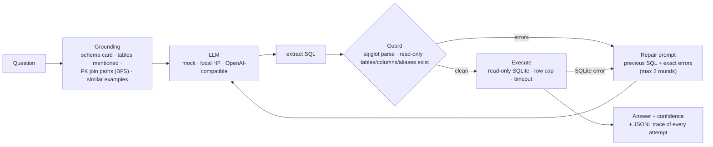

# nl2sql-agent

**A schema-grounded natural-language-to-SQL agent: foreign-key join-path resolution, a read-only SQL guard that feeds its errors back into a bounded repair loop, evidence traces for every attempt, and an evaluation harness with deterministic result matching. Measured on a 30-question golden set with a local 1.5B model on a laptop GPU.**

  [](https://github.com/gandhiashutosh14/nl2sql-agent/actions/workflows/ci.yml) 

---

## What it is, and why

Text-to-SQL demos usually stop at "the model wrote a query". Production systems need the rest: the model must only see real tables and columns, be told how tables join, be prevented from writing anything, get a second chance with the actual error when it is wrong, and be scored on whether the answer is right rather than whether the SQL looks plausible. This repository is that pipeline, built on the public Chinook database and evaluated with a model small enough to run on a laptop.

## How it works



The evaluation harness runs a golden set through the agent and scores **execution success**, **result match** (row multisets compared after normalising numbers, case and order), and optionally an **LLM judge** for formulations that differ but answer the question.

## Measured results

`Qwen/Qwen2.5-Coder-1.5B-Instruct`, fp16 on an RTX 4050 laptop GPU, greedy decoding, 30 questions, 2026-09-16 (report committed as [`reports/qwen2.5-coder-1.5b-instruct.md`](reports/qwen2.5-coder-1.5b-instruct.md)):

| Metric | Value |
|---|---|
| Execution success | 29 / 30 |
| Result match (deterministic) | 24 / 30 |
| Repairs used: none / one / two | 24 / 5 / 1 |
| Median latency per question | 2.1 s |
| Whole run | 128 s |

What the six misses were, from the mismatch section of the report: three unnecessary joins (the model joined Employee or Genre when the question involved one table, once dropping a GROUP BY as a result), one unit error (5 minutes became 500,000 ms), one wrong column that survived both repair rounds, and one self-join formulation of a subquery question. The join-hint logic and the prompt were tightened after this run (hints now cover only tables the question names; the prompt forbids unneeded joins and states 1 minute = 60,000 ms); a re-run with those changes was started but stopped before completion, so the numbers above are for the code before the tightening, and the report file carries a provenance note saying so.

## What is measured, and how

| Question | Answer |
|---|---|
| What database? | SQLite only (`data/chinook.sqlite`, the public Chinook sample, invoice years 2021 to 2025 in this build). Another engine needs a new executor and a sqlglot dialect string. |
| What can the generated SQL do? | Only read. The guard refuses anything that is not one read-only statement before the database sees it, and the executor opens the file with `mode=ro`, caps rows at 200 and cancels after 5 s. The read-only connection is itself tested with an INSERT. |
| What is a "repair"? | The model gets the exact guard or SQLite error and one more try, at most twice. Confidence is 1.0 / 0.7 / 0.5 by repairs used; below 0.5 the answer is `needs_review`. |
| Which numbers came from a model? | Only the table above (Qwen2.5-Coder-1.5B, one GPU run, 30 questions). Everything else in `reports/` was produced without a model. |
| What did the harness itself score? | [`reports/oracle-harness.md`](reports/oracle-harness.md): the golden SQL replayed as if a model had written it scores 30 / 30 on execution and result match with zero repairs. That proves the harness, guard, executor and matcher agree on every reference query; it says nothing about any model. The same run with the questions changed scores 0 / 30 on match, so the matcher is not trivially satisfied (tested). |
| What does the guard reject? | [`reports/guard-rejections.md`](reports/guard-rejections.md): 17 fixed inputs (writes, DDL, PRAGMA, two statements, unterminated strings, unknown tables and columns, and clean queries with aliases and CTEs) with the outcome and the sentence the model would be shown. Generated by `python scripts/show_guard.py`; a test asserts every outcome. |
| One known failure | g22 ("Which sales support agent generated the most invoice revenue?"): the model put `SupportRepId` on Employee instead of Customer, the guard reported the exact column list, and both repairs kept the mistake. The trace of that case is in the report. |
| What is not measured | Any other database, questions the author did not write, models other than the one above, and the LLM-judge path (implemented and mock-tested, unused for the numbers). |

## Key features

- **Schema grounding from the database itself**: tables, types, primary keys, foreign keys and row counts are introspected and rendered into a compact schema card. Join hints come from BFS over the foreign-key graph, so the model is told `Track.AlbumId = Album.AlbumId` rather than guessing.
- **Curated examples, retrieved by lexical overlap**, teach house conventions such as `strftime('%Y', InvoiceDate)` for years.
- **A guard that fails loudly and usefully**: single statement only, SELECT only, every table and column checked against the schema with alias, CTE and select-list-alias awareness. Errors are sentences the model can act on.
- **Bounded repair**: at most two repair rounds, each carrying the previous SQL and the exact guard or SQLite error. Confidence is derived from repairs used; below threshold the answer is returned as `needs_review`, never presented as fact.
- **Evidence**: every attempt (raw reply, SQL, guard errors, execution error, timings) is written to `traces/traces.jsonl`.
- **Evaluation harness** with a Markdown report, per-case table and a mismatch appendix.

## Tech stack

Python 3.10+ · sqlglot · SQLite · optional: PyTorch + Transformers for local models, any OpenAI-compatible endpoint (OpenAI, Groq, Ollama, vLLM) via `openai:<model>`.

## Quick start

```bash
git clone https://github.com/gandhiashutosh14/nl2sql-agent.git
cd nl2sql-agent
python -m venv .venv && .venv\Scripts\activate      # macOS/Linux: source .venv/bin/activate
pip install -e ".[dev]"
pytest -q                                            # 50 passed, mock model, no GPU

nl2sql schema --db data/chinook.sqlite               # schema card + join graph

# No model needed: replay the golden SQL through the whole pipeline (harness check, 30/30 expected)
nl2sql eval --db data/chinook.sqlite --llm oracle:golden/chinook_golden.json \
  --golden golden/chinook_golden.json --report reports/oracle-harness.md

# No model needed: what the guard does with 17 fixed inputs
python scripts/show_guard.py --db data/chinook.sqlite --out reports/guard-rejections.md

# Local model (needs the hf extra: pip install -e ".[hf]"; ~3 GB download, GPU recommended)
nl2sql ask --db data/chinook.sqlite --llm hf:Qwen/Qwen2.5-Coder-1.5B-Instruct \
  --examples examples/chinook_examples.json "Which country has the most customers?"

# Any OpenAI-compatible endpoint (Ollama: NL2SQL_BASE_URL=http://localhost:11434/v1)
nl2sql eval --db data/chinook.sqlite --llm openai:gpt-4o-mini --examples examples/chinook_examples.json \
  --golden golden/chinook_golden.json --report reports/run.md --json reports/run.json
```

## Project layout

```
nl2sql/schema.py      introspection, schema card, join paths, table mentions
nl2sql/guard.py       parse, read-only enforcement, identifier validation
nl2sql/executor.py    read-only execution with row cap and timeout
nl2sql/examples.py    few-shot bank + retrieval
nl2sql/prompts.py     prompt contracts, SQL extraction, judge parsing
nl2sql/llm.py         mock / oracle (golden replay) / local HF / OpenAI-compatible backends
scripts/show_guard.py fixed inputs through the guard -> reports/guard-rejections.md
nl2sql/agent.py       the loop, confidence, traces
nl2sql/evaluate.py    golden-set harness and report
golden/               30 questions with reference SQL (tested to run and return real answers)
examples/             12 few-shot examples
reports/              the model run, the oracle harness run, the guard outcomes
docs/DEVELOPMENT_NOTES.md  how this was built, including every bug the runs found
```

## Status and scope

Working prototype. One database, one golden set the author wrote, one small model; the numbers are a sanity check of the agent, not a benchmark of the model. Dialect support is SQLite; other engines need an executor and dialect string change. The LLM-judge path is implemented and tested with a mock but was not used for the committed numbers.

## License

MIT. See [LICENSE](LICENSE).
